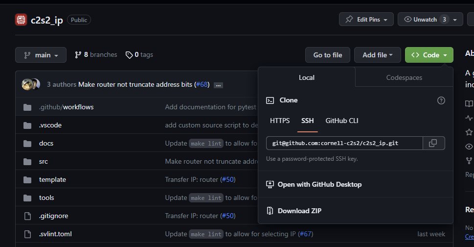

# `Git`/`Github` Quickstart

For a more comprehensive tutorial, check out the [Confluence Git/Github Primer](https://confluence.cornell.edu/pages/viewpage.action?pageId=476108648).

## Cloning repositories

If you haven't yet, you'll want to set up github with the ecelinux machine, which you can do by following [this tutorial](https://confluence.cornell.edu/pages/viewpage.action?spaceKey=c2s2&title=Configuring+GitHub+for+our+server).


Cloning a repository is how you get code stored remotely on Github onto your machine. To do so, you'll need the link to your github repository. Go to the repository, click the `<> Code` button, and select `SSH` from the three options under `Clone`.



Copy the link shown, and then run
```
git clone <repository_link>
```
replacing `<repository_link>` with the link to your repository.

This will create a new folder with the name of your repository, and clone all the remote code into it. In our case, this will create the `c2s2_ip` folder.

## Commits

Commits are a way to version code. Each commit stores the changes it made from its last commit, which allows us to save the history of each file in our github repository. You can think of this as your edit history, and each `commit` as a save in that edit history.

### Staging

Before we make a commit, we run
```
git add .
```
to **stage** all our files. Staging a file means we are ready to commit a file, and lets us commit certain files without committing incomplete ones.
* In order to stage specific files, do `git add path/to/file.txt`
* Wildcards like `git add *.txt` or `git add path/*` are also supported.

### Committing
Running
```
git commit -m "name of commit"
git push
```
will create a commit with all your changes, and then pushes it to github. This takes all your staged changes and "saves" them in the edit history.

In general, *name your commits with a short description of their changes*. Each commit should contain approximately one logical addition/modification, and for good practice we recommend **committing frequently** so that changes can be undone easily.

Here are a couple examples of when to commit:
1. Just finished the first prototype of a block but haven't tested it yet.
2. Added a couple passing (or failing) tests to a block.
3. Formatted some code to make it look nicer.
4. Documented some code.

Try to avoid doing many of these steps at once and then committing them all together.

## Branches

All of our work is done on github **branches**.

### What is a Branch?

(**TODO**)